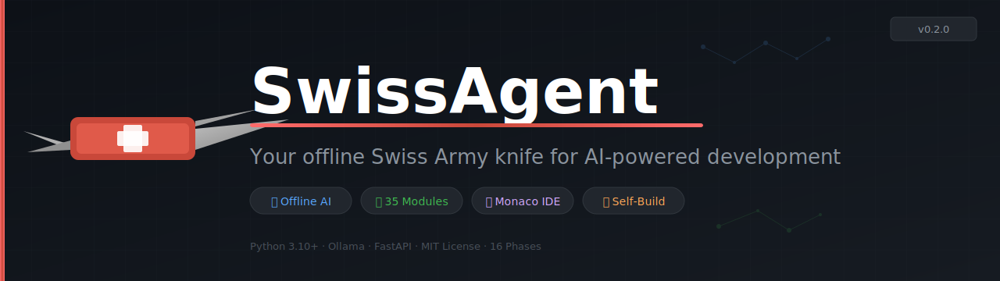

<p align="center">
  
</p>

<p align="center">
  <a href="https://python.org"></a>
  <a href="LICENSE"></a>
  
  
  
  
  
</p>

<p align="center">
  <strong>SwissAgent</strong> is a self-hosted, fully offline AI development platform.<br/>
  Give it a prompt and it plans, calls tools, writes code, runs builds, processes assets, and reports back — <em>all without sending anything to the cloud.</em>
</p>

<p align="center">
  
</p>

---

> 🐳 **Docker is completely optional.** SwissAgent runs perfectly with just **Python 3.10+** and **Ollama**.  
> 📖 **New here?** Read the **[Step-by-step Setup Guide →](docs/SETUP.md)** including no-Docker, Windows, and all LLM backends.

---

## ✨ What can SwissAgent do?

| Capability | Details |
|---|---|
| 🤖 **Agentic AI loop** | plan → tool-call → execute → reflect, up to 20 iterations per task |
| 🧩 **35 built-in modules** | 195+ tools: filesystem, git, build, image, audio, zip, docs, packages, debug, render, and more |
| 🖥️ **Monaco Web IDE** | VS Code–style editor with AI chat panel, inline ghost-text completions, and 6 activity-bar panels |
| 🔌 **Plugin system** | Drop a Python file into `plugins/` — auto-loaded with no restart needed |
| 🔒 **Permission system** | Fine-grained allow/block control over tools and file paths |
| 🏗️ **Self-build loop** | Reads its own roadmap, writes code, tests in Docker sandbox, commits — fully autonomously |
| 📦 **Archive & packaging** | ZIP / TAR / 7z via `/archive/*` — pack releases, extract downloads, distribute builds |
| 📄 **Doc generator** | Auto-generate Markdown / HTML / JSON docs from Python source via `/doc/generate` |
| 🌐 **Network tools** | Download files and make HTTP requests via `/network/*` |
| 📥 **Package manager** | Install / list packages with pip, npm, cargo, gem, or go via `/packages/*` |
| 🖼️ **Image processing** | Resize, convert, and inspect images via `/image/*` (Pillow) |
| 🔊 **Audio processing** | Convert, trim, and inspect audio via `/audio/*` (FFmpeg / pydub) |
| 🐛 **Process debug** | Inspect running processes, read memory, capture stack traces via `/debug/*` |
| 🎨 **Asset pipeline** | 2D/3D/audio/video generation wired into the agent loop |
| 🎙️ **Audio pipeline** | Offline TTS via `pyttsx3` and SFX generation via SoX |
| 🖼️ **Stable Diffusion** | Image generation via AUTOMATIC1111 web-UI API |
| 🏠 **Multi-project workspace** | Manage multiple projects from one place |
| 📡 **REST API** | Full HTTP API — use from any language or tool |

---

## 🚀 Quick Start

```bash
# Clone and install (one command)
git clone https://github.com/shifty81/SwissAgent.git && cd SwissAgent
bash scripts/install.sh          # installs deps + opens the IDE in your browser
```

**Windows:**
```powershell
git clone https://github.com/shifty81/SwissAgent.git
cd SwissAgent
python -m venv .venv && .venv\Scripts\Activate.ps1
pip install -e .
python -m core.cli ui
```

Then open **http://localhost:8000** — you'll see the Monaco IDE with 6 activity-bar panels.

> 💡 See **[docs/SETUP.md](docs/SETUP.md)** for the full walkthrough including virtual environments, all LLM backends, and Docker Compose.

---

## 🧠 LLM Backends

| Backend | Flag | Notes |
|---|---|---|
| **Ollama** *(default)* | `--llm-backend ollama` | Local server at `localhost:11434`. No key needed. Best for offline use. |
| **LocalAI** | `--llm-backend localai` | Docker-based OpenAI-compatible server. Great for GGUF/GPTQ models. |
| **Open WebUI** | `--llm-backend openwebui` | Chat UI at `localhost:3000` that can push code into the IDE. |
| **API** | `--llm-backend api` | Any OpenAI-compatible endpoint (OpenAI, Anthropic, Groq, etc.). |
| **Local GGUF** | `--llm-backend local` | Run a `.gguf` model directly via `llama-cpp-python`. |

```bash
# Recommended models via Ollama
ollama pull llama3              # general purpose
ollama pull deepseek-coder      # coding tasks
ollama pull qwen2.5-coder       # code + reasoning
```

---

## 📋 Prerequisites

| Requirement | Status | Notes |
|---|---|---|
| **Python 3.10+** | ✅ Required | [python.org](https://www.python.org/) |
| **Ollama** | ✅ Recommended | [ollama.com](https://ollama.com) — free, offline |
| **Git** | ✅ Required | For the `git` module |
| **Docker** | ⚙️ Optional | Only for Compose stack or container sandbox |
| **CMake / Make** | ⚙️ Optional | For the `build` module |
| **Blender** | ⚙️ Optional | For the `blender` / `render` modules |
| **FFmpeg** | ⚙️ Optional | For audio conversion in the `audio` module |
| **Pillow** | ⚙️ Optional | For image processing in the `image` module |
| **SoX** | ⚙️ Optional | For SFX generation in the audio pipeline |

---

## 🗂️ Modules (35 built-in)

<details>
<summary><strong>Click to expand the full module list</strong></summary>

| Module | Description |
|---|---|
| `filesystem` | File read/write/copy/move/delete/list |
| `git` | init, clone, commit, push, pull, diff, log, status |
| `build` | CMake/Make/Ninja build system integration |
| `script` | Python, shell, Lua, Node.js, Java, C# execution |
| `network` | HTTP GET/POST, file download/upload |
| `image` | Resize, convert, crop, rotate, thumbnail |
| `zip` | ZIP/TAR/7z archive creation and extraction |
| `audio` | Audio conversion, trim, normalise, merge |
| `doc` | Documentation generation (Markdown/HTML/JSON) |
| `debug` | Process inspection, stack trace, memory info |
| `package` | pip/npm/cargo/gem/go package management |
| `cache` | Disk-based key-value build artifact caching |
| `memory` | Persistent agent memory (store/recall/search) |
| `security` | Secret scanning, file hashing, checks |
| `index` | Full-text code indexing and regex search |
| `editor` | Code formatting (black, prettier, clang-format) |
| `database` | SQLite/SQL query and management |
| `ui` | UI boilerplate (ImGui, HTML/CSS, Win32) |
| `template` | Project scaffolding from templates |
| `test` | Test runner (pytest, unittest) |
| `ci` | CI/CD pipeline integration |
| `installer` | Application and dependency installer |
| `server` | Local development server management |
| `render` | Rendering and image output |
| `shader` | Shader compilation and management |
| `blender` | Blender integration for 3D content |
| `animation` | Animation data processing |
| `tile` | Tilemap and tileset tooling |
| `asset` | Asset management and tracking |
| `resource` | Game/app resource management |
| `binary` | Binary file analysis and manipulation |
| `pipeline` | Asset and data processing pipelines |
| `profile` | Performance profiling tools |
| `job` | Background job scheduling |
| `api` | REST/GraphQL API client utilities |

</details>

---

## 🌐 REST API Highlights

Start the server: `swissagent serve`, then explore all endpoints at **http://localhost:8000/docs**.

```bash
# Health check
curl http://localhost:8000/health

# Run the AI agent
curl -X POST http://localhost:8000/run \
  -H "Content-Type: application/json" \
  -d '{"prompt": "list Python files in workspace/"}'

# Phase 16: Pack a ZIP archive
curl -X POST http://localhost:8000/archive/pack \
  -H "Content-Type: application/json" \
  -d '{"src": "workspace/myproject", "dst": "workspace/myproject.zip", "format": "zip"}'

# Phase 16: Generate documentation
curl -X POST http://localhost:8000/doc/generate \
  -H "Content-Type: application/json" \
  -d '{"src": "modules/", "output": "workspace/docs/README.md", "format": "markdown"}'

# Phase 16: Install a package
curl -X POST http://localhost:8000/packages/install \
  -H "Content-Type: application/json" \
  -d '{"name": "requests", "manager": "pip"}'

# Phase 16: Resize an image
curl -X POST http://localhost:8000/image/resize \
  -H "Content-Type: application/json" \
  -d '{"path": "workspace/logo.png", "width": 128, "height": 128}'

# Phase 16: Inspect a running process
curl "http://localhost:8000/debug/process?pid=12345"
```

---

## 🏗️ Autonomous Self-Build (Phase 13)

SwissAgent can build *itself* — reading its own roadmap, writing code, running tests in a Docker sandbox, and committing:

```
roadmap_next_task()
  → LLM generates code
  → apply_patch() writes files
  → Docker sandbox: pytest tests/
  → pass  → git commit + roadmap_complete_task() → next task
  → fail  → retry (max 3) → rollback on final fail
```

**Guardrails:** sandboxed execution · permission system · blocked files · opt-in only.  
See [`docs/self_iteration.md`](docs/self_iteration.md) for the full loop diagram.

---

## 🧩 Plugin System

Drop a Python file into `plugins/` — auto-loaded at startup:

```python
# plugins/my_tool.py
def register(registry):
    def greet(name: str) -> str:
        return f"Hello, {name}!"
    registry.register(
        {"name": "greet", "description": "Greet a person", "module": "my_tool"},
        greet,
    )
```

---

## 🖥️ IDE Panels

| Panel | Icon | Description |
|---|---|---|
| **Explorer** | 📁 | File tree with read/write/create/delete |
| **Search** | 🔍 | Full-text search across all workspace files |
| **Git** | 🔀 | Status, diff viewer, stage/commit |
| **Code Quality** | ✅ | Format, lint, workspace stats, symbol search |
| **Templates** | 📋 | Browse templates, run snippets, toolchain info |
| **Utilities** | ⚙️ | Archive, docs, packages, image, audio, debug (Phase 16) |

---

## ⚙️ Configuration

Edit `configs/config.toml`:

```toml
[agent]
max_iterations = 20
default_llm_backend = "ollama"

[llm.ollama]
base_url = "http://localhost:11434"
model = "llama3"

[permissions]
allowed_dirs = ["workspace", "projects", "cache", "logs"]
blocked_dirs  = ["configs", "core", "llm"]

[server]
host = "127.0.0.1"
port = 8000
```

---

## 📁 Project Structure

```
SwissAgent/
├── core/           # Agent loop, CLI, REST API, config, permissions, tool registry
├── llm/            # LLM backends: Ollama, LocalAI, OpenAI-compatible, local GGUF
├── modules/        # 35 capability modules (tools.json + src/)
├── plugins/        # Drop-in custom tool plugins
│   └── open_webui_tool/  # Open WebUI → IDE push plugin
├── configs/        # config.toml — all runtime settings
├── gui/            # Web IDE (Monaco editor, Copilot-style chat, 6 panels)
├── workspace/      # Default project workspace + roadmap.json
├── projects/       # Additional managed projects
├── models/         # Local GGUF model files
├── audio_pipeline/ # Offline TTS and SFX generation
├── stable_diffusion/ # AUTOMATIC1111 image generation interface
├── stage_manager/  # Project milestone tracker
├── dev_mode/       # Agent self-upgrade and module patching
├── tools/          # Build runner, feedback parser, media pipeline
├── templates/      # Project scaffolding templates
├── scripts/        # install.sh, setup.py, run_tests.py
├── tests/          # Pytest test suite
└── docs/           # Extended documentation + banner
```

---

## 🧪 Testing

```bash
pip install -e ".[dev]"
pytest tests/ -v --tb=short
```

---

## 🐳 Docker (Optional Full Stack)

```bash
# Build the SwissAgent image
bash scripts/docker-build.sh   # or: docker build -t swissagent:latest .

# Start the full AI stack (SwissAgent + LocalAI + Open WebUI)
docker compose up -d

# Open the IDE:     http://localhost:8000
# Open the chat UI: http://localhost:3000
```

See [`docs/SETUP.md`](docs/SETUP.md) for the complete Docker guide.

---

## �� Roadmap

SwissAgent is developed against a living roadmap stored in `workspace/roadmap.json`:

| Phase | Title | Status |
|---|---|---|
| 1–5 | Foundation, Web IDE, Build, Project Mgmt, Roadmap | ✅ Done |
| 6–10 | VS Code IDE, AI Editor, Plugin Ecosystem, Sandbox, Auth | ✅ Done |
| 11–13 | Open-Source AI Stack, Self-Scaffolding, Autonomous Self-Build | ✅ Done |
| 14 | Code Quality & Developer Experience | ✅ Done |
| 15 | Project Templates & Multi-Language Toolchain | ✅ Done |
| **16** | **General-Purpose Utility APIs** | ✅ **Done** |

---

## 📄 License

MIT — see [LICENSE](LICENSE)

---

<p align="center">
  Built with ❤️ as a fully offline, self-improving AI development platform.<br/>
  <em>No cloud required. No data leaves your machine.</em>
</p>
